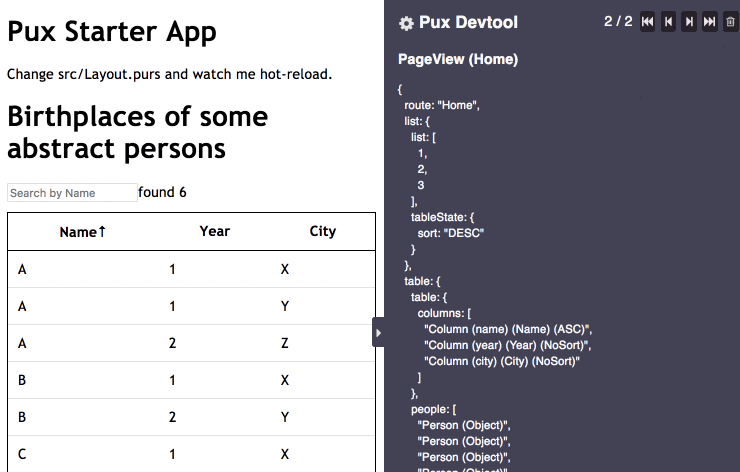

# pux-table

*With multisorting*

Not actually package, but example how to create sorted table in purescript pux.

Inspired by [Elm Sortable Table](https://github.com/evancz/elm-sortable-table/)

Example based on starter [Pux](https://github.com/alexmingoia/purescript-pux/) application.

See the [Guide](https://alexmingoia.github.io/purescript-pux) for help learning
Pux.

